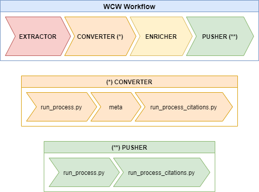

# wcw
## Wikipedia Citations in Wikidata

This is the repository of the [Wikipedia Citations in Wikidata grant](https://meta.wikimedia.org/wiki/Wikicite/grant/Wikipedia_Citations_in_Wikidata).
It's a collection of scripts that can be used to extract citations from the English Wikipedia to 
external bibliographic resources, and then to upload them to Wikidata.

**[A complete diagram with a description of all the workflow steps is available here!](resources/WorkflowDiagram.pdf)**

## Project description
Quoting the [grant's description](https://meta.wikimedia.org/wiki/Wikicite/grant/Wikipedia_Citations_in_Wikidata#Description):

> Our goal is to develop four software modules in Python (the codebase from now on) that can be
>    easily reused by developers in the Wikidata community:
>  1. [**extractor**](Extractor) a module to extract citation and bibliographic information from articles in
>    the English Wikipedia;
>  2. [**converter**](Converter) a module to convert extracted information into a CSV-based format compliant
>    with a shareable bibliographic data model, e.g., the OpenCitations Data Model;
>  3. [**enricher**](Enricher) a module for reconciling bibliographic resources and people (obtained in step 2)
>    with entities available in Wikidata via their persistent identifiers (primarily DOIs, 
>    QIDs, ORCIDs, VIAFs, then also persons, places and organisations if time allows);
>  4. [**pusher**](Pusher) a module to disambiguate, deduplicate, and load citation and bibliographic data
>    in Wikidata that reuses code already developed by the wikidata community as much as possible.

The repository folder structure reflects these same modules that constitue the entire workflow.

## Instructions
Each module has a `README` file that contains specific instructions on how to setup the execution
environment, on how to configure the modules and how to run them. Here, only a general overview of the 
entire process is given.

This particular workflow strictly requires that the user executes the given scripts in a particular
order:
  1. the [**Extractor**](Extractor) module takes as input a dump of the current English Wikipedia pages and outputs 
     a parquet dataset containing the extracted citations. Our suggestion is to directly download the
     [parquet dataset from here at Zenodo](https://zenodo.org/record/3940692#.X9JOIun0mL8) (the ZIP 
     file to be downloaded is called **"citations_from_wikipedia.zip"**).
  2. the [**Converter**](Converter) module takes as input the parquet dataset from the previous step and produces a 
     set of RDF files which are [OCDM compliant](https://figshare.com/articles/online_resource/Metadata_for_the_OpenCitations_Corpus/3443876).
  3. the [**Enricher**](Enricher) module takes as input the RDF files from the previous step and tries to enrich them
     as much as possible by adding external identifiers coming from various APIs. When the external
     identifiers are added, a deduplication step is applied to each RDF file.
  4. the [**Pusher**](Pusher) module take as input the enriched RDF files from the previous step and produces TSV
     files compliant with the QuickStatements input format that enable the user to bulk upload the
     citational data onto Wikidata.
     

More details can be found inside the `README` documents of each module; please refer to them for specific
information about the inner workings of each workflow step.

## External projects used
Some external tools were reused, in particular:
*  [oc_ocdm](https://github.com/opencitations/oc_ocdm) [[docs](https://oc-ocdm.readthedocs.io/en/latest/)], an ORM library
   that allows to easily manipulate OCDM compliant RDF graphs through a well-defined API. It's available as a package on
   PyPi ([click here](https://pypi.org/project/oc-ocdm/));
*  [oc_graphenricher](https://github.com/opencitations/oc_graphenricher) [[docs](https://oc-graphenricher.readthedocs.io/en/latest/)],
   a tool that's able to enrich a set of OCDM entities with external identifiers and then to apply a deduplication step so to
   remove duplicated entities that share at least one identical identifier. It's available as a package on
   PyPi ([click here](https://pypi.org/project/oc-graphenricher/));
*  [meta](https://github.com/opencitations/meta), a tool that is able to apply a lot of preprocessing and data-cleaning techniques
   to a given CSV file with a compatible format. It then generates and stores an OCDM compliant RDF graph containing the same
   bibliographical information that was extracted from the CSV file. Its execution can require a lot of time, because of the complexity of
   the operations that have to be executed on the given dataset;
*  [cite-classifications-wiki](https://github.com/Harshdeep1996/cite-classifications-wiki), a set of scripts that are intended
   to be run in a pyspark/hadoop environment which is distributed over a cluster of machines. It's able to digest a full Wikipedia
   dump and to extract from it citations to external bibliographical resources. It's currently limited to the English version
   of Wikipedia.

They can be used outside of this context for purposes different from those of this project. All of them were very
helpful for the development of this workflow. More information about them can be found in their respective GitHub repositories.

## Tests
Tests (together with their instructions) can be found in the following subfolders:

| Workflow step | Test subfolder |
|---|---|
| Extractor | [test](Extractor/test) |
| Converter | [test](Converter/test) |
| Enricher | [test](Enricher/test) |
| Pusher | [test](Pusher/test) |

## License
Distributed under the ISC License. See `LICENSE` for more information.

## Contacts
|Project member |e-mail address |
|---|---|
| Silvio Peroni - [@essepuntato](https://twitter.com/essepuntato) | essepuntato@gmail.com |
| Marilena Daquino | marilena.daquino2@unibo.it |
| Giovanni Colavizza | giovannicolavizza@gmail.com |
| Gabriele Pisciotta | ga.pisciotta@gmail.com |
| Simone Persiani | iosonopersia@gmail.com |

Project Link: https://github.com/opencitations/wcw

## Acknowledgements
This project has been developed within the context of the ["Wikipedia Citations in Wikidata" grant](https://meta.wikimedia.org/wiki/Wikicite/grant/Wikipedia_Citations_in_Wikidata), 
under the supervision of prof. Silvio Peroni.
